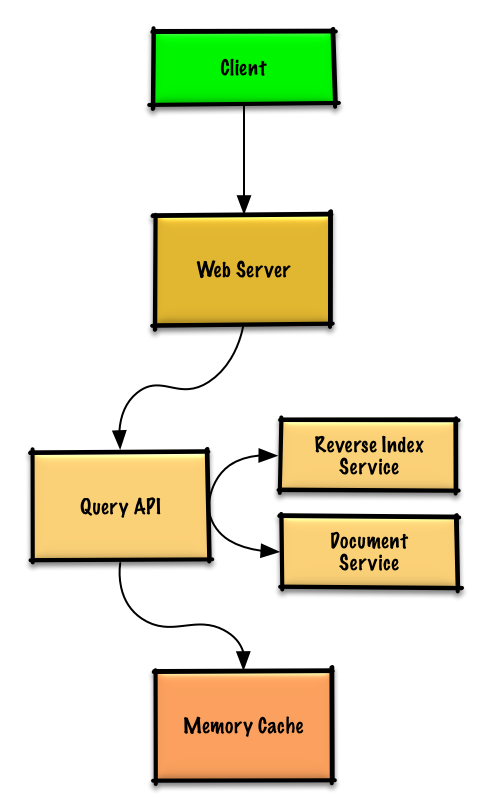

# CacheQuery
## Use case
- User sends a search request resulting in a cache hit
- User sends a search request resulting in a cache miss

```
curl.exe http://localhost:8080/query?query=hello+sweden
```
Response
```
[{"content":" Hello sweden","id":3,"snippet":"Hi","title":"Greets3"}]
```

- Service has high availability

## Design



## Rationale

Popular queries can be served from a Memory Cache such as Redis or Memcached to reduce read latency and to avoid overloading the Reverse Index Service and Document Service

Since the cache has limited capacity, we'll use a least recently used (LRU) approach to expire older entries.


### Use case

- The Client sends a request to the Web Server, running as a reverse proxy
- The Web Server forwards the request to the Query API server
- The Query API server does the following:
  - Parses the query
    - Removes markup
    - Breaks up the text into terms
    - Fixes typos
    - Normalizes capitalization
    - Converts the query to use boolean operations
  - Checks the Memory Cache for the content matching the query
    - If there's a hit in the Memory Cache, the Memory Cache does the following:
      - Updates the cached entry's position to the front of the LRU list
      - Returns the cached contents
    - Else, the Query API does the following:
      - Uses the Reverse Index Service to find documents matching the query
        - The Reverse Index Service ranks the matching results and returns the top ones
      - Uses the Document Service to return titles and snippets
      - Updates the Memory Cache with the contents, placing the entry at the front of the LRU list

      
## Compile
### third party

```
vcpkg install mongo-cxx-driver:x64-windows nlohmann-json:x64-windows boost-beast:x64-windows abseil:x64-windows
```

### compiler
VS2019 or above(C++17)

## Extension
- Load balancer for Web server
- Expanding the Memory Cache to many machines
  - The cache is sharded across all machines in the cache cluster(consistent hashing)
- More cache-updating strategies such as time to live (TTL).